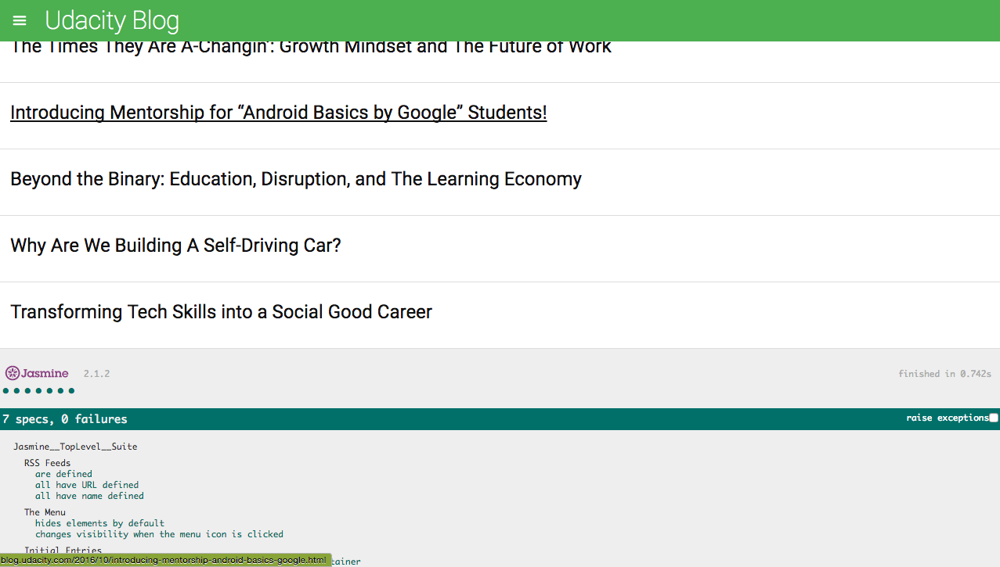

# feedreader - TDD using Jasmine

## Project Overview
In this project I was given a web-based application that reads RSS feeds. The original developer of this application clearly saw the value in testing, they had already included Jasmine and even started writing their first test suite! Unfortunately, they decided to move on to start their own company and we're now left with an application with an incomplete test suite. That's where I come in.

## WHY ?
Writing effective tests requires analyzing multiple aspects of an application including the HTML, CSS and JavaScript - an extremely important skill when changing teams or joining a new company.
Good tests give you the ability to quickly analyze whether new code breaks an existing feature within your codebase, without having to manually test all of the functionality.

## Installation

1. Clone the repo
$ git clone https://github.com/sonalikatara/feedReader.git
$ cd feedReader

2. Open up index.html in your browser of choice.

3. The test suites are in feedReader/jasmine/spec/feedreader.js

